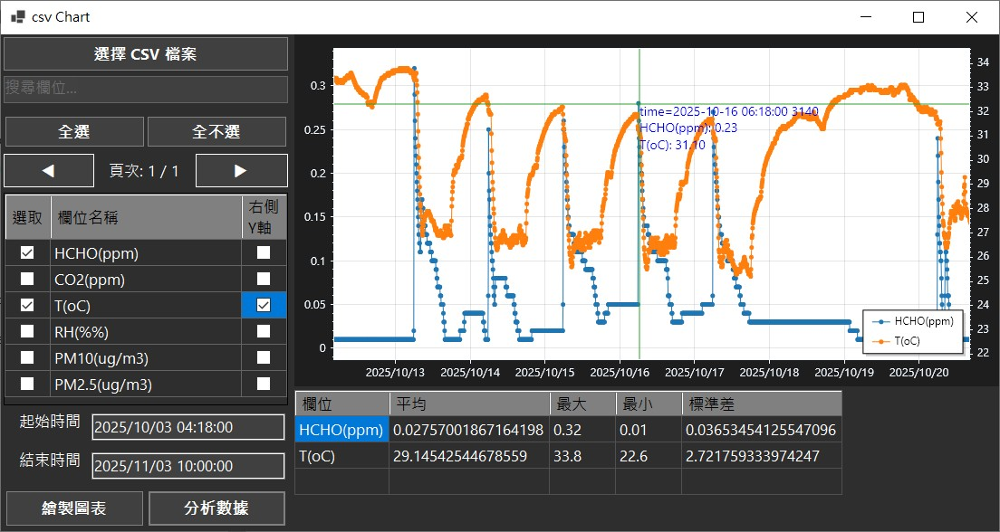

# CsvScottPlotIndustrial

---

# 操作說明
## 🖱️ 檔案輸入+曲線繪製

### 1. 點擊 **"選擇檔案"** 按鈕，開啟檔案選擇對話框。
### 2. 在對話框中瀏覽並選擇要分析的 CSV 檔案，然後點擊 **"開啟"**。
### 3. 程式將自動讀取並解析 CSV 檔案中的數據，第一欄必須為時間碼，其他欄位必須為數字，會自動排除非數字欄位
### 4. 數字欄位會列於再 下方Check 選單中，點擊選擇所需畫圖的欄位(多選)。
### 5. 選擇完成後，點擊左下方 **"繪製圖表"** 按鈕，程式將根據選定的數據欄位繪製曲線圖。

## 🖱️ 曲線數值分析

### 1. 選擇 **"起始時間"** 、**"結束時間"** 設定分析時間範圍。
### 2. 選擇完成後，點擊左下方 **"分析數據"** 按鈕，程式將根據選定的時間範圍，分析各欄位的Max./Min/AVG/STD數值。

---

# 附註：ScottPlot 曲線圖操作說明

使用 **ScottPlot** 庫進行數據視覺化。為了提供流暢的使用者體驗，UI 介面支援多種滑鼠互動方式，讓使用者能直覺地瀏覽與分析曲線數據。

## 🖱️ 互動操作指南

以下是針對 ScottPlot 控制項的預設操作說明：

### 1. 全域縮放 (Global Zoom)
* **操作方式：** 滾動滑鼠 **中間滾輪**。
* **功能：** 以滑鼠當前位置為中心，同時針對 **X 軸與 Y 軸** 進行放大或縮小，雙擊滾輪可以進行 **Auto-Scale**。
* **技巧1：** 向上滾動為放大（Zoom In），向下滾動為縮小（Zoom Out）。
* **技巧2：** 游標移到 X軸線範圍(曲線區域外)，向上滾動為放大X軸（Zoom In），向下滾動為縮小X軸（Zoom Out），Y軸Scale不變。
* **技巧3：** 游標移到 Y軸線範圍(曲線區域外)，向上滾動為放大Y軸（Zoom In），向下滾動為縮小Y軸（Zoom Out），X軸Scale不變。

### 2. 畫布平移 (Panning)
* **操作方式：** 按住 **滑鼠左鍵** 並拖曳。
* **功能：** 自由移動圖表畫布，可隨意平移曲線以觀察不同區段的數值，而不會改變縮放比例。

### 3. 視窗 Zoom
* **Zoom Window：** 按住 **Alt** 並以 **滑鼠左鍵** 拖曳出視窗。
* **功能：** 視窗放大功能。
* **Zoom X：** 按住 **Alt** 並以 **滑鼠左鍵** 於圖外X軸處拖曳出寬度。
* **功能：** X寬度放大功能。
* **Zoom Y：** 按住 **Alt** 並以 **滑鼠左鍵** 於圖外X軸處拖曳出高度。
* **功能：** Y高度放大功能。

### 4. 進階單軸縮放 (Axes Zoom)
除了滾輪縮放外，ScottPlot 支援更精確的單軸拖曳縮放功能：
* **操作方式：** 按住 **滑鼠右鍵** 並拖曳（預設行為）。
    > **註：** 若你的 UI 邏輯已自定義為右鍵縮放，其行為如下：
* **X 軸縮放：** 左右（X+/X-）拖曳滑鼠，可單獨拉伸或壓縮水平時間/數值軸。
* **Y 軸縮放：** 上下（Y+/Y-）拖曳滑鼠，可單獨調整垂直振幅/高度軸。

### 5. 開啟選單
* **操作方式：**  **滑鼠左鍵** 點擊 Click，可以開啟選單。
* **功能：** 選擇選單上所需要功能。

---

## 💡 快捷鍵小技巧

| 動作 | 快捷鍵 / 滑鼠 | 功能描述 |
| :--- | :--- | :--- |
| **自動調整縮放** | 滑鼠中鍵點擊 (Middle Click) | 自動縮放至適配所有數據點 (Auto-Axis) |
| **開啟選單** | 滑鼠右鍵點擊 (Right Click) | 開啟設定選單，可匯出圖片或儲存數據 |
| **鎖定軸線** | 按住 `Alt` + 拖曳 | 鎖定特定軸線進行操作 |

---
