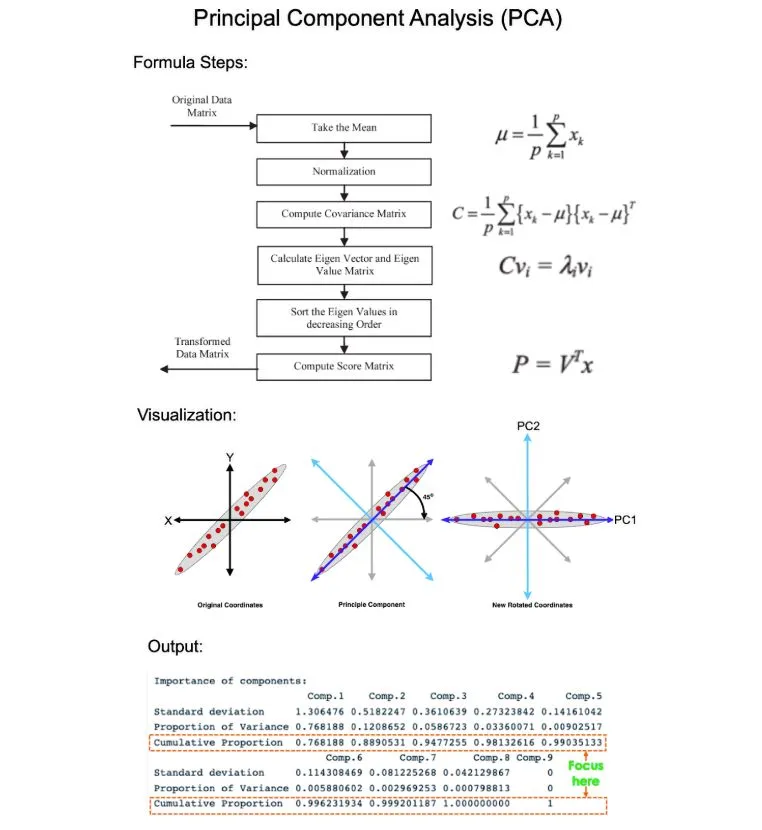
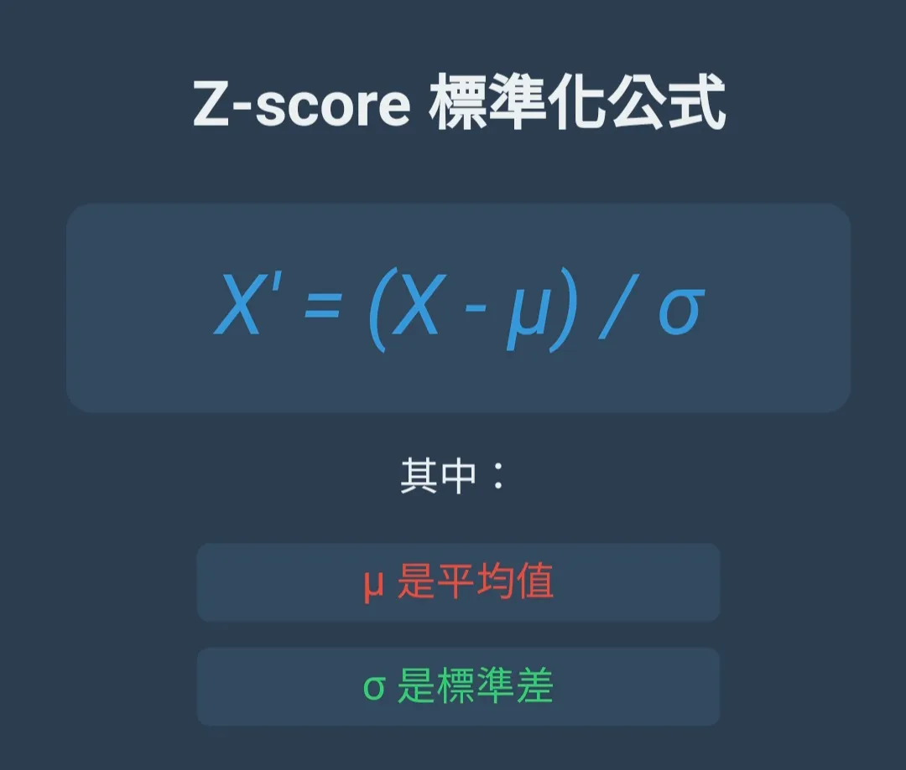
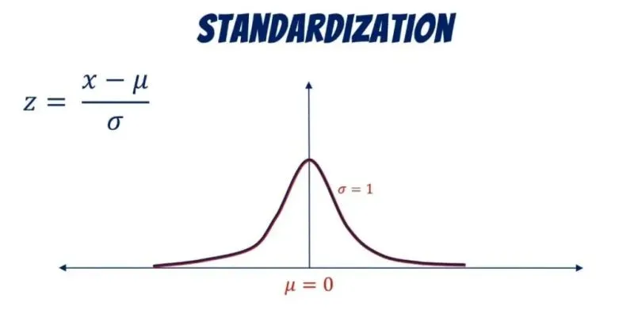
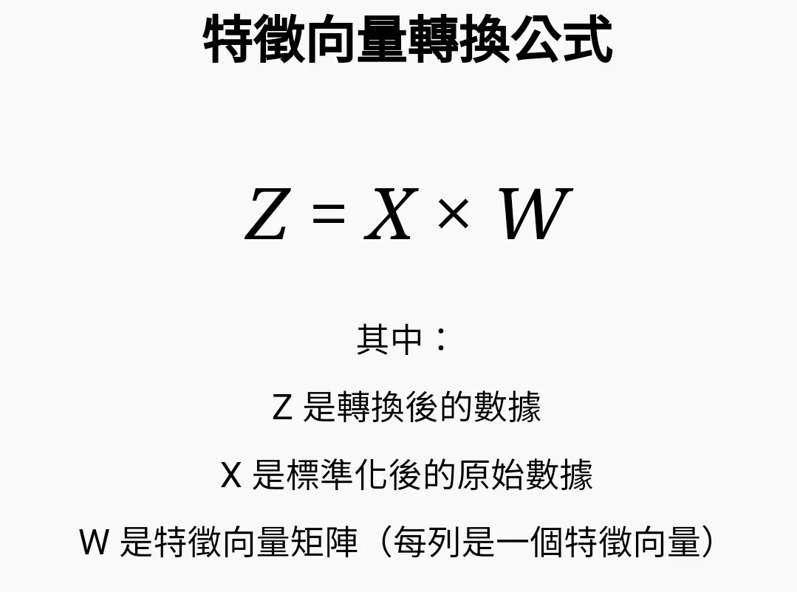
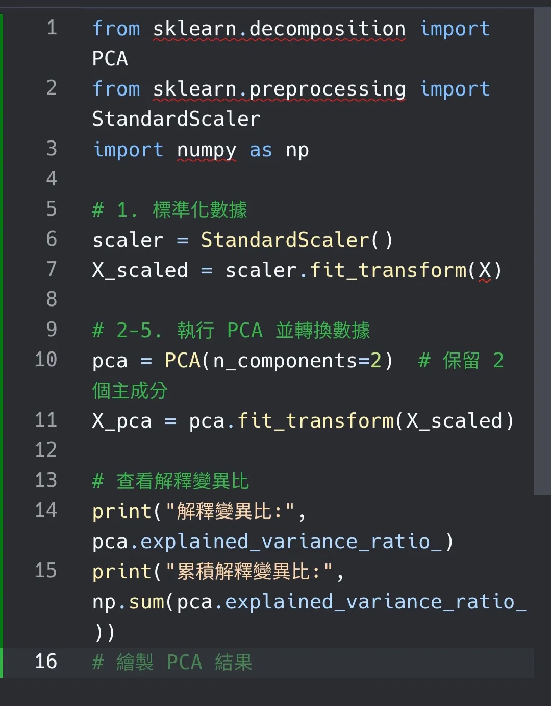

在機器學習與深度學習的實務應用中，將強化學習（Reinforcement Learning, RL）與主成分分析（Principal Component Analysis, PCA）結合，是一種用來解決「維度災難」並提升 Agent（智能體）訓練效率的核心策略。 [1] 
以下為您梳理這兩種核心技術的結合背景、主要應用場景與實作優缺點：
------------------------------
## 💡 為什麼強化學習需要結合 PCA？
在標準的強化學習中，Agent 必須觀察環境的「狀態空間（State Space）」來決定下一步的動作。當遇到高維度的環境（例如：金融市場的數百種技術指標、高解析度相機畫面、多關節機器人的感測器數據）時，會面臨以下瓶頸： [2, 3] 

   1. 維度災難 (Curse of Dimensionality)：狀態空間隨著特徵增加呈指數級增長，導致 Agent 需要花費極大代價去探索。
   2. 資訊冗餘與雜訊：原始數據中往往包含許多正交、相關性高或無效的雜訊，干擾神經網路的判斷。
   3. 訓練收斂過慢：高維度輸入意味著模型需要更新更多的權重參數，大幅拖慢訓練速度。 [1, 4, 5, 6] 

PCA 的角色：作為一種非監督式線性降維技術，PCA 能將高維度的狀態特徵，投影到變異量最大的核心方向（主成分），剔除冗餘、消除特徵間的相關性，轉換為低維度且高資訊量的緊湊表徵（Compact Representation）提供給 RL。 [6, 7, 8, 9] 
------------------------------
## ⚙️ 兩者結合的三大主要應用場景## 1. 金融量化交易與資產配置 (Portfolio Management)

* 應用方式：金融市場充滿上百種強烈相關的股票價格、技術指標與宏觀數據。實務上會先使用 Rolling PCA（滾動主成分分析） 提取出市場的隱含因子（如趨勢、波動度、反轉因子），再將這些「主成分特徵」輸入給深度 reinforcement learning 模型（如 PPO 或 DDPG）來決定買進、賣出或持有。
* 優勢：避免 RL 因市場雜訊過多而產生過度擬合（Overfitting）。 [4, 10, 11] 

## 2. 機器人控制與點雲處理 (Robotic Control & Point Clouds)

* 應用方式：在 3D 視覺導航或機器手臂抓取任務中，環境回傳的是龐大的「點雲（Point Cloud）」數據。利用 PCA 可以快速找出物體或環境的主軸方向（Canonical Pose），對點雲進行歸一化或特徵壓縮。
* 優勢：大幅提升機器人在面對不同視角、攝影機位置偏移時的控制魯棒性（Robustness）。 [12] 

## 3. 複雜網格與遊戲環境的探索優化 (Exploration Aiding)

* 應用方式：在大型迷宮（GridWorld）或經典遊戲（如 Mario）中，狀態特徵極其繁複。一些進階演算法（如 PCA-Explore）會利用 PCA 來捕捉 Agent 過去探索路徑的特徵，找出環境中未被充分開拓的低頻率方向，指導 Agent 進行更高效的「主動探索」，避免在原地鬼打牆。 [1, 13, 14] 

------------------------------
## 📊 結合後的優缺點權衡（Trade-off）

| 項目 [1, 6, 9, 15, 16, 17] | 優點 (Pros) | 缺點與挑戰 (Cons) |
|---|---|---|
| 訓練效率 | 顯著提升收斂速度：狀態空間變小，RL 模型需要學習的參數變少。 | 資訊丟失風險：PCA 拋棄的低變異量成分，有時可能包含 RL 決策的關鍵訊號。 |
| 運算成本 | 降低硬體消耗：記憶體佔用變低，每一步（Step）的前向與反向傳播速度變快。 | 無法處理非線性：PCA 是線性降維，若環境狀態為高度複雜的非線性關係，效果受限（此時多改用 Autoencoder 自動編碼器）。 |
| 資料品質 | 去相關性與過濾雜訊：特徵彼此正交，輸入給神經網路時更加穩定。 | 動態環境失效：若環境本身的動態特徵隨時間劇烈改變，固定的 PCA 投影矩陣會失真，需頻繁重新計算。 |

------------------------------
## 🛠️ 實務開發建議
如果您正準備將 PCA 導入您的強化學習專案：

   1. 先標準化（Standardization）：在將狀態數據送入 PCA 之前，務必進行 Z-score 標準化，否則數值範圍大的特徵會完全主導主成分。
   2. 設定合理的累積貢獻率：不要盲目追求極致降維。通常建議保留能解釋 85% 到 95% 總變異量（Variance Explained） 的主成分數量。
   3. 替代方案考慮：如果降維後發現 RL 的總回報（Reward）大幅下降，說明線性 PCA 抹煞了關鍵細節，此時可考慮使用 KPCA（核主成分分析） 或 Autoencoder（自動編碼器） 來捕捉非線性特徵。 [5, 6, 16, 17, 18] 

------------------------------


```
[1] [https://ewrl.wordpress.com](https://ewrl.wordpress.com/wp-content/uploads/2015/02/ewrl12_2015_submission_24.pdf)
[2] [https://www.ctworld.org.tw](https://www.ctworld.org.tw/monthly/249/t01.htm)
[3] [https://www.cupoy.com](https://www.cupoy.com/marathon-mission/000001744E3494FE000000016375706F795F72656C656173654355/000001800F37DC6C0000002C6375706F795F72656C656173654349)
[4] [https://medium.com](https://medium.com/@abatrek059/double-deep-q-learning-and-principal-component-analysis-for-portfolio-management-an-implementation-710446e060c3)
[5] [https://ithelp.ithome.com.tw](https://ithelp.ithome.com.tw/m/articles/10298965)
[6] [https://developer.aliyun.com](https://developer.aliyun.com/article/1474403)
[7] [https://www.tejwin.com](https://www.tejwin.com/insight/pca-%E7%89%B9%E5%BE%B5%E6%8A%95%E8%B3%87%E7%B5%84%E5%90%88/)
[8] [https://ithelp.ithome.com.tw](https://ithelp.ithome.com.tw/m/articles/10302865)
[9] [https://vocus.cc](https://vocus.cc/article/683414befd897800019184b9)
[10] [https://www.linkedin.com](https://www.linkedin.com/pulse/machine-learning-algorithmic-trading-pca-statistical-nicholas-burgess-sqnme)
[11] [https://medium.com](https://medium.com/@abatrek059/deep-reinforcement-learning-for-cross-sectional-alpha-part-two-dde678ed4698)
[12] [https://arxiv.org](https://arxiv.org/abs/2510.20974)
[13] [https://scholarworks.calstate.edu](https://scholarworks.calstate.edu/downloads/pn89df480)
[14] [https://www.scribd.com](https://www.scribd.com/document/979429047/2-Mark-Answers)
[15] [https://vocus.cc](https://vocus.cc/article/68b8802efd897800016f81f4)
[16] [https://www.nature.com](https://www.nature.com/articles/s41598-026-53752-5)
[17] [https://hackmd.io](https://hackmd.io/@joanne8826/HJgZZ6rIO)
[18] [https://www.threads.com](https://www.threads.com/@danieltsai04/post/DHL9THtSMn8/%E5%AD%B8%E7%BF%92%E8%B3%87%E6%96%99%E7%A7%91%E5%AD%B8%E7%AC%AC376%E5%A4%A9-%E7%9B%B4%E5%88%B0%E6%88%90%E7%82%BA%E6%A5%AD%E5%85%A7%E4%BA%BA%E5%A3%ABpca-%E6%87%B6%E4%BA%BA%E5%8C%855-%E5%88%86%E9%90%98%E6%90%9E%E6%87%82%E9%99%8D%E7%B6%AD%E9%AD%94%E6%B3%95%E6%83%B3%E8%AE%93%E8%A4%87%E9%9B%9C%E6%95%B8%E6%93%9A%E8%AE%8A%E7%B0%A1%E5%96%AE%E9%82%84%E8%83%BD%E4%BF%9D%E7%95%99%E9%97%9C%E9%8D%B5%E8%B3%87%E8%A8%8Apca%E4%B8%BB%E6%88%90%E5%88%86%E5%88%86%E6%9E%90%E5%B0%B1%E6%98%AF%E4%BD%A0%E7%9A%84%E6%95%B8%E6%93%9A%E7%98%A6%E8%BA%AB%E7%A5%9E%E5%99%A8%E9%80%99%E7%AF%87%E5%B8%B6%E4%BD%A0-5-%E5%88%86)
```

--------------------------
學習資料科學第376天✍️ 直到成為業內人士
PCA 懶人包：5 分鐘搞懂降維魔法！
想讓複雜數據變簡單，還能保留關鍵資訊？
PCA（主成分分析）就是你的數據瘦身神器！
這篇帶你 5 分鐘學會 PCA 的核心概念，從標準化到數據轉換，簡單易懂，讓你輕鬆掌握降維技巧！
1. PCA 是什麼？數據的減法藝術！
PCA，全名主成分分析（Principal Component Analysis），是一種統計方法，專門用來減少數據的維度，但同時保留最重要的資訊。
適用場景：
- ✅ 變數太多時，刪減不必要的資訊，讓數據更精簡！
- ✅ 數據有關聯性時，幫你找出最重要的變化方向！
- ✅ 視覺化高維數據，把 10 維、100 維的數據壓縮成 2 維或 3 維，方便分析！
- ✅ 去除數據中的雜訊，保留重要的信號！
簡單來說，PCA 幫你用更少的變數，捕捉最多的數據特徵！  




2. PCA 五步驟：簡單跟著做！
PCA 的核心流程其實很規律，只要掌握 5 個步驟就能理解它的運作方式：
1️⃣ 標準化數據（避免數值大小影響分析）
2️⃣ 計算共變異數矩陣（看變數之間的關係）
3️⃣ 求解特徵值與特徵向量（找出主要變化方向）
4️⃣ 選擇主成分（決定要保留幾個維度）
5️⃣ 轉換數據（將數據投影到新空間）

3. 第一步：標準化數據 → 讓變數公平競爭！
數據中的變數（特徵）可能有不同的單位，例如收入（萬元）、身高（公分）、體重（公斤），這些數據的數值範圍不同，可能影響 PCA 分析結果。
解決方法：標準化！
- ✅ 讓每個變數的平均值變成 0，標準差變成 1
- ✅ 確保不同變數的影響力不會被數值大小誤導
公式（Z-score 標準化）：
如圖
> 提示： 有時候會用 Min-Max 標準化，將數據轉換到 [0,1] 區間，但在 PCA 中，Z-score 標準化更常用。
標準化後，每個變數的數值範圍變一致，PCA 才能正確比較數據的變異性！





4. 第二步：計算共變異數矩陣 → 找出變數的關聯性！
PCA 不只關心變數本身，還會關注變數之間的關係！
這裡我們會計算共變異數矩陣（Covariance Matrix）或相關性矩陣（Correlation Matrix），來了解變數之間的聯動情況。
兩種常用矩陣：
- ✅ 共變異數矩陣：保留原始變數的尺度信息
- ✅ 相關性矩陣：當變數使用不同單位時更合適（實際上是標準化後的共變異數矩陣）
如果共變異數是：
- 正數 → 兩個變數一起增加或減少（正相關）
- 負數 → 一個變大時，另一個變小（負相關）
- 接近 0 → 兩者關係不大
PCA 透過這些矩陣，找到數據中變化最多的方向，這就是下一步的關鍵

5. 第三步：計算特徵值 & 特徵向量 → 找到主要變化方向！
特徵值（Eigenvalue）和特徵向量（Eigenvector）是 PCA 的核心數學概念。
- 特徵向量：表示數據主要變動的方向
- 特徵值：代表這個方向的資訊量大小
舉例來說：
- 📈 如果某個特徵向量的特徵值很大，表示這個方向上的變異性最大 → 這就是主要的「主成分」！
> 實務提示：這一步在實際應用中通常使用專業軟體（如 Python 的 scikit-learn、R 的 prcomp）自動計算，不需要手動求解特徵值方程。
我們會根據特徵值大小，排序出最重要的變化方向，並決定要保留多少個主成分。

6. 第四步：選擇主成分 → 用最少的數據，保留最多資訊！
我們已經找到了所有的主成分，但不是每個主成分都重要。
📌 選擇主成分的標準：
- ✅ 按特徵值大小排序（越大越重要）
- ✅ 計算累積解釋變異比（Cumulative Explained Variance Ratio）
- ✅ 使用陡坡圖（Scree Plot）視覺化特徵值的分布
一般建議：
- 累積解釋變異比超過 70%～90% 就足夠！
- 觀察陡坡圖中的「彎曲點」，保留該點之前的主成分
例如：
- 前 2 個主成分能解釋 85% 的數據變異量 → 這 2 個就夠用了！
- 其他主成分只貢獻少量資訊，可以忽略！
這步驟就像整理行李，只帶走最重要的物品，省去不必要的負擔！  


-------------------------------------------------------------------------------------------
學習資料科學第376天✍️ 直到成為業內人士
PCA 懶人包：5 分鐘搞懂降維魔法！
想讓複雜數據變簡單，還能保留關鍵資訊？
PCA（主成分分析）就是你的數據瘦身神器！

這篇帶你 5 分鐘學會 PCA 的核心概念，從標準化到數據轉換，簡單易懂，讓你輕鬆掌握降維技巧！
1. PCA 是什麼？數據的減法藝術！
PCA，全名主成分分析（Principal Component Analysis），是一種統計方法，專門用來減少數據的維度，但同時保留最重要的資訊。
適用場景：
- ✅ 變數太多時，刪減不必要的資訊，讓數據更精簡！
- ✅ 數據有關聯性時，幫你找出最重要的變化方向！
- ✅ 視覺化高維數據，把 10 維、100 維的數據壓縮成 2 維或 3 維，方便分析！
- ✅ 去除數據中的雜訊，保留重要的信號！
簡單來說，PCA 幫你用更少的變數，捕捉最多的數據特徵！  


2. PCA 五步驟：簡單跟著做！
PCA 的核心流程其實很規律，只要掌握 5 個步驟就能理解它的運作方式：
1️⃣ 標準化數據（避免數值大小影響分析）
2️⃣ 計算共變異數矩陣（看變數之間的關係）
3️⃣ 求解特徵值與特徵向量（找出主要變化方向）
4️⃣ 選擇主成分（決定要保留幾個維度）
5️⃣ 轉換數據（將數據投影到新空間）
接下來，我們來一步步拆解！  


3. 第一步：標準化數據 → 讓變數公平競爭！
數據中的變數（特徵）可能有不同的單位，例如收入（萬元）、身高（公分）、體重（公斤），這些數據的數值範圍不同，可能影響 PCA 分析結果。
解決方法：標準化！
- ✅ 讓每個變數的平均值變成 0，標準差變成 1
- ✅ 確保不同變數的影響力不會被數值大小誤導
公式（Z-score 標準化）：
如圖
> 提示： 有時候會用 Min-Max 標準化，將數據轉換到 [0,1] 區間，但在 PCA 中，Z-score 標準化更常用。
標準化後，每個變數的數值範圍變一致，PCA 才能正確比較數據的變異性！  


4. 第二步：計算共變異數矩陣 → 找出變數的關聯性！
PCA 不只關心變數本身，還會關注變數之間的關係！
這裡我們會計算共變異數矩陣（Covariance Matrix）或相關性矩陣（Correlation Matrix），來了解變數之間的聯動情況。
兩種常用矩陣：
- ✅ 共變異數矩陣：保留原始變數的尺度信息
- ✅ 相關性矩陣：當變數使用不同單位時更合適（實際上是標準化後的共變異數矩陣）
如果共變異數是：
- 正數 → 兩個變數一起增加或減少（正相關）
- 負數 → 一個變大時，另一個變小（負相關）
- 接近 0 → 兩者關係不大
PCA 透過這些矩陣，找到數據中變化最多的方向，這就是下一步的關鍵！  


5. 第三步：計算特徵值 & 特徵向量 → 找到主要變化方向！
特徵值（Eigenvalue）和特徵向量（Eigenvector）是 PCA 的核心數學概念。
- 特徵向量：表示數據主要變動的方向
- 特徵值：代表這個方向的資訊量大小
舉例來說：
- 📈 如果某個特徵向量的特徵值很大，表示這個方向上的變異性最大 → 這就是主要的「主成分」！
> 實務提示：這一步在實際應用中通常使用專業軟體（如 Python 的 scikit-learn、R 的 prcomp）自動計算，不需要手動求解特徵值方程。
我們會根據特徵值大小，排序出最重要的變化方向，並決定要保留多少個主成分。  


6. 第四步：選擇主成分 → 用最少的數據，保留最多資訊！
我們已經找到了所有的主成分，但不是每個主成分都重要。
📌 選擇主成分的標準：
- ✅ 按特徵值大小排序（越大越重要）
- ✅ 計算累積解釋變異比（Cumulative Explained Variance Ratio）
- ✅ 使用陡坡圖（Scree Plot）視覺化特徵值的分布
一般建議：
- 累積解釋變異比超過 70%～90% 就足夠！
- 觀察陡坡圖中的「彎曲點」，保留該點之前的主成分
例如：
- 前 2 個主成分能解釋 85% 的數據變異量 → 這 2 個就夠用了！
- 其他主成分只貢獻少量資訊，可以忽略！
這步驟就像整理行李，只帶走最重要的物品，省去不必要的負擔！  


7. 第五步：轉換數據 → 進入新維度！
最後，我們將原始數據投影到主成分空間，讓數據變得更精簡，維度更少，但資訊量仍然充足！
PCA 轉換後，數據的特性：
- ✅ 變數之間不再相關（解決多重共線性問題）
- ✅ 前幾個主成分保留最多資訊，後面的影響較小
- ✅ 可以視覺化高維數據，讓分析更直觀！
- ✅ 轉換後的各主成分可以清晰解釋為原始變數的線性組合
公式：如圖
至此，PCA 就完成啦！🚀




8. PCA 的真實應用場景
PCA 廣泛應用於各個領域，這裡是一些實際例子：
- 人臉辨識：Eigenfaces 技術使用 PCA 將臉部特徵壓縮
- 圖像壓縮：減少圖像表示所需的資訊量
- 基因數據分析：分析基因表達數據的主要變異來源
- 金融風險管理：識別影響投資組合的主要風險因素
- 自然語言處理：降低文本向量的維度，提高效率
- 異常偵測：識別與主成分方向偏離較大的異常樣本


9. PCA 的局限性
PCA 強大但並非萬能，了解它的局限性也很重要：
- ⚠️ 只能捕捉線性關係，對非線性模式效果不佳
- ⚠️ 對離群值敏感，極端值可能影響結果
- ⚠️ 主成分可能難以解釋，不直觀理解它們的物理意義
- ⚠️ 假設數據服從正態分佈，對非正態分佈的數據效果可能不佳
> 遇到這些問題時，可以考慮核 PCA（Kernel PCA）、穩健 PCA 或其他非線性降維技術。
結論：用 PCA 讓數據更精簡、更好理解！
PCA 本質上就是一種「數據壓縮技術」，但不只是單純刪減，而是讓你用「更少的變數」來描述數據的核心資訊！
📌 回顧一下 5 大步驟：
- ✅ 標準化數據 → 確保變數公平競爭
- ✅ 計算共變異數矩陣 → 找出變數之間的關聯性
- ✅ 計算特徵值 & 特徵向量 → 找出最重要的變化方向
- ✅ 選擇主成分 → 只保留最關鍵的資訊
- ✅ 轉換數據 → 讓數據變簡單但資訊仍完整

Python 實現 PCA 只需幾行代碼：
如圖
學會 PCA，以後面對高維數據也能輕鬆駕馭！快試試吧！




