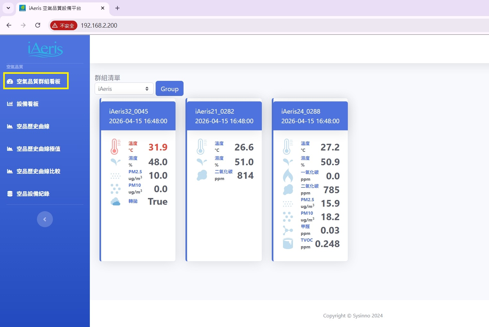
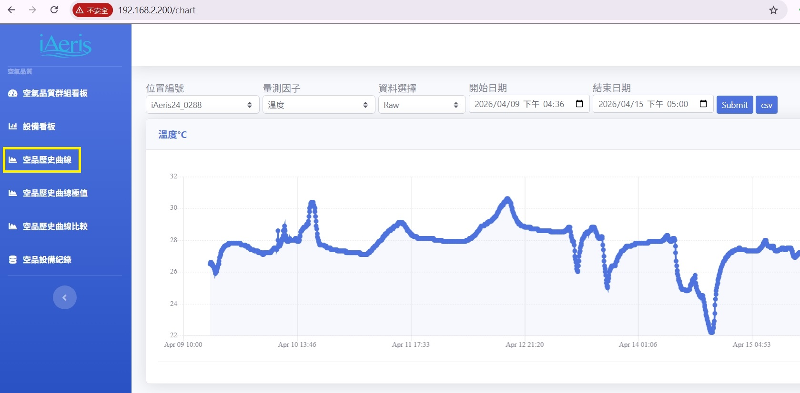
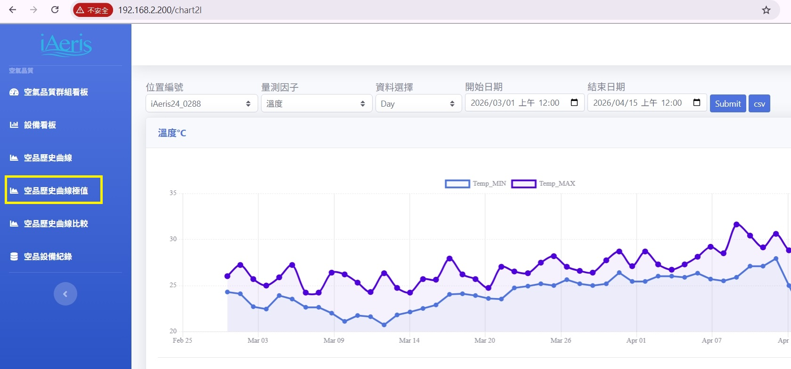
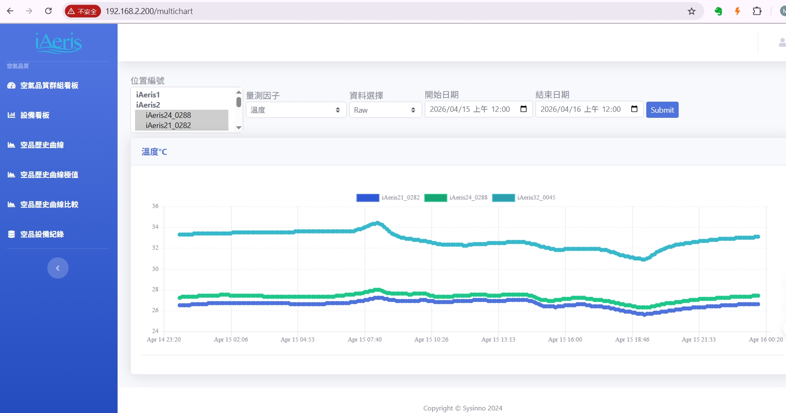
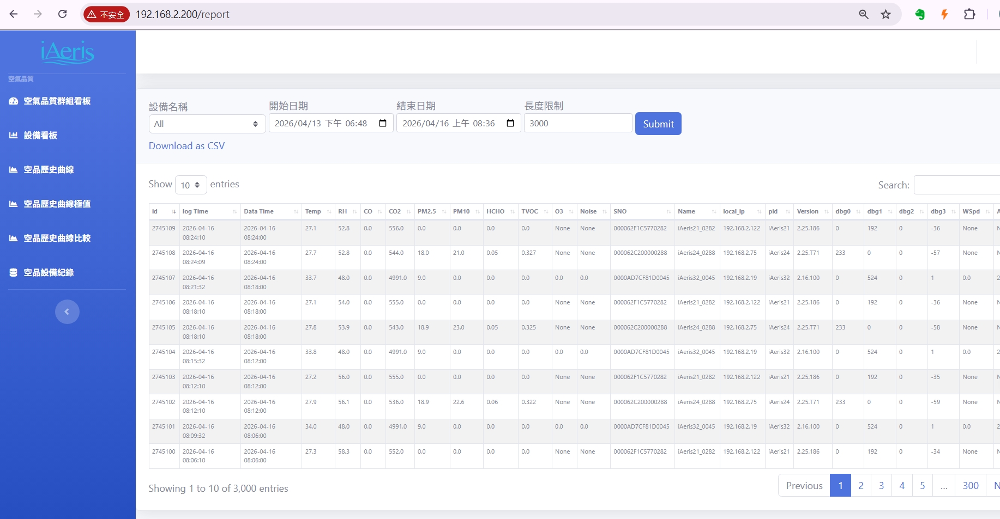

# 🌐 iAeris 本地雲端系統概覽

本系統由 ** Joe ** 開發，旨在提供完整的室內空氣品質監測與管理解決方案。

## 📊 空品系統功能規格

* **設備數據顯示**：支援分群組顯示設備數據，並收集各因子即時數值。

* **設備統計數據顯示**：支援分群組顯示設備統計數據：即時統計設備 在/離線 狀況，以及各因子正常或超規的數量。
<video width="100%" height="auto" autoplay loop muted playsinline>
  <source src="../static/images/iaeris-system/device_info.mp4" type="video/mp4">
  您的瀏覽器不支援 HTML5 影片播放。
</video>

* **歷史曲線分析**：提供分、時、日、月的均值歷史曲線顯示與下載。

* **歷史極值分析**：提供時、日、月的與極值歷史曲線顯示與下載。

  
* **設備數值比較**：提供多設備量測數值比對。

* **數據查詢**：支援完整的設備數據查詢與 CSV 下載功能 。

---

## 🔐 帳號權限管理
[cite_start]系統設有嚴謹的權限區分，確保數據安全與設定管理 [cite: 281]：
* [cite_start]**一般帳號**：系統預設權限，僅可觀看 Dashboard 相關功能 [cite: 282, 283]。
* [cite_start]**管理帳號**：登入後可切換至管理權限，執行以下功能 [cite: 284, 285]：
    * [cite_start]註冊新帳號與修改密碼 [cite: 286, 287]。
    * [cite_start]設定設備因子警示上下限與通知機制 [cite: 288]。
    * [cite_start]設定設備離線通知、群組配置及設備基礎設定 [cite: 289, 290, 291]。

---

## ⚙️ 硬體與系統需求
[cite_start]為了確保 iAeris 本地雲端系統穩定執行，建議硬體配置如下 [cite: 321]：

| 項目 | [cite_start]最低需求 [cite: 322] |
| :--- | :--- |
| **CPU** | [cite_start]Intel® Core™ i3 2.3 GHz 或以上 [cite: 323] |
| **RAM** | [cite_start]8 GB 或以上 [cite: 324] |
| **系統空間** | [cite_start]20 GB 根分區 [cite: 325] |
| **儲存空間** | [cite_start]100 GB 資料儲存分區 (用於索引與文檔)  |
| **作業系統** | [cite_start]Ubuntu 18.04+ 或 Windows 10+ [cite: 328, 329] |

---

## 📡 資料傳輸架構
[cite_start]系統支援多種通訊協議以適應不同場景 [cite: 293, 310]：
* [cite_start]**iAeris 作為 Client**：透過 HTTP POST API 或 MQTT Broker 傳送資料至伺服器 [cite: 305, 306, 307]。
* [cite_start]**iAeris 作為 Server**：支援 Modbus RTU/TCP 協議供伺服器讀取 [cite: 308, 309]。
* [cite_start]**警示通知**：支援 **Telegram** 與 **Discord** 因子超標或設備離線即時通知 [cite: 311, 312, 313, 314]。

---

## 🛠 快速設定指南 (Windows)
1. [cite_start]**設定固定 IP**：進入網路設定，手動配置 IPC 的 IP/Mask/Gateway 與 DNS [cite: 494, 499, 500]。
2. [cite_start]**設備連線**：透過 RS485 連線至電腦，使用 `iAerisSW` 軟體設定 Cloud 為 `Custom cloud(HTTP)` [cite: 507, 508]。
3. [cite_start]**主機導向**：將主機固定 IP 填入 Address 欄位，並將 **Port 設定為 1180** [cite: 510, 526]。
4. [cite_start]**開啟系統**：於瀏覽器輸入 `http://<主機IP>:1180` 即可開啟管理網頁 [cite: 537]。